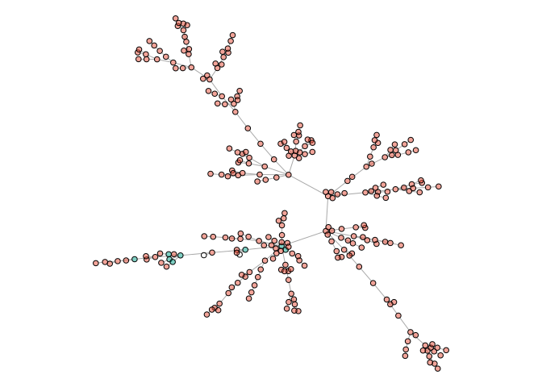
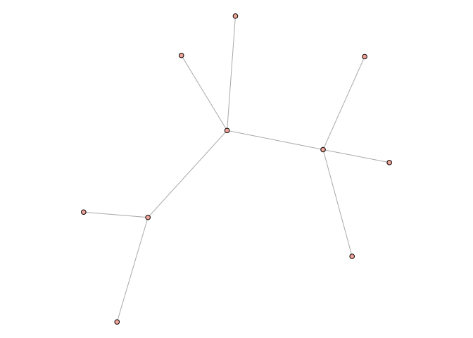
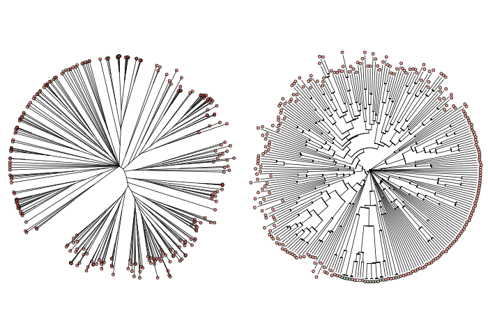

MLSTar
================

This R package allows you to easily determine the Multi Locus Sequence Type (MLST) of your genomes. It also works as an interface between [PubMLST](https://pubmlst.org/) through their [RESTful API](https://pubmlst.org/rest/), so you don't have to bother downloading and collecting files: the application does it automatically. Today the package works in Unix-based systems.

Installation
------------

The easiest way to install this package is using `devtools`:

``` r
devtools::install_github('iferres/MLSTar')
```

### Requirements

`MLSTar` depends on [BLAST+](https://blast.ncbi.nlm.nih.gov/Blast.cgi?CMD=Web&PAGE_TYPE=BlastDocs&DOC_TYPE=Download) software, and must be installed in your `$PATH` prior to run this package.

Standard workflow
-----------------

The first step in your analysis should be to check the in pubmlst.org database if your organism of interest is available. So, first load the package and then run `listPubmlst_orgs()` function, printing only the first 50 elements:

``` r
library(MLSTar)
```

    ## Loading required package: igraph

    ## 
    ## Attaching package: 'igraph'

    ## The following objects are masked from 'package:stats':
    ## 
    ##     decompose, spectrum

    ## The following object is masked from 'package:base':
    ## 
    ##     union

    ## Loading required package: ape

    ## 
    ## Attaching package: 'ape'

    ## The following objects are masked from 'package:igraph':
    ## 
    ##     edges, mst, ring

``` r
listPubmlst_orgs()[1:50]
```

    ##  [1] "achromobacter"           "abaumannii"             
    ##  [3] "aeromonas"               "aphagocytophilum"       
    ##  [5] "arcobacter"              "bcereus"                
    ##  [7] "blicheniformis"          "bsubtilis"              
    ##  [9] "bbacilliformis"          "bhenselae"              
    ## [11] "bordetella"              "borrelia"               
    ## [13] "brachyspira"             "brucella"               
    ## [15] "bcc"                     "bpseudomallei"          
    ## [17] "campylobacter_nonjejuni" "campylobacter"          
    ## [19] "calbicans"               "cglabrata"              
    ## [21] "ctropicalis"             "cmaltaromaticum"        
    ## [23] "chlamydiales"            "cfreundii"              
    ## [25] "csinensis"               "cbotulinum"             
    ## [27] "cdifficile"              "csepticum"              
    ## [29] "cdiphtheriae"            "cronobacter"            
    ## [31] "dnodosus"                "edwardsiella"           
    ## [33] "ecloacae"                "efaecalis"              
    ## [35] "efaecium"                "fpsychrophilum"         
    ## [37] "gallibacterium"          "hinfluenzae"            
    ## [39] "hparasuis"               "hcinaedi"               
    ## [41] "helicobacter"            "hsuis"                  
    ## [43] "kaerogenes"              "koxytoca"               
    ## [45] "kseptempunctata"         "lsalivarius"            
    ## [47] "leptospira"              "mcanis"                 
    ## [49] "mcaseolyticus"           "mplutonius"

Lets say we are interested in Leptospira genus, which is in the place 47 in the list above. So:

``` r
lst <- listPubmlst_orgs() 
lst[47]
```

    ## [1] "leptospira"

Now, lets check for available MLST schemes for this organism:

``` r
listPubmlst_schemes(org = lst[47])
```

    ## $scheme_1
    ## [1] "glmU_1" "pntA_1" "sucA_1" "tpiA_1" "pfkB_1" "mreA_1" "caiB_1"
    ## attr(,"Desc")
    ## [1] "MLST (scheme 1)"
    ## 
    ## $scheme_2
    ## [1] "adk_2"    "glmU_2"   "icdA_2"   "lipL32_2" "lipL41_2" "mreA_2"  
    ## [7] "pntA_2"  
    ## attr(,"Desc")
    ## [1] "MLST (scheme 2)"
    ## 
    ## $scheme_3
    ## [1] "adk_3"    "icdA_3"   "lipL32_3" "lipL41_3" "rrs2_3"   "secY_3"  
    ## attr(,"Desc")
    ## [1] "MLST (scheme 3)"

As you can see, `listPubmlst_schemes` return a list with the loci names corresponding to each scheme. As an attribute of each list element there is information about each mlst scheme.

Now you can choose between two ways: the easy way and the hard way.

The hard way implies calling `downloadPubmlst_seq(org = lst[43], scheme = 1)` and then `downloadPubmlst_profile(org = lst[43], scheme = 1)` functions included in this package to download the scheme fasta files and the profile tab file for the organism and the scheme of interest, and then passing the files to the subsequent `doMLST()` function to `schemeFastas` and `schemeProfile` arguments.

The easy way is to left those arguments `NULL` (default), and let the `doMLST()` function do it for you.

Let see an example with toy data attached on this package:

``` r
#First we list the atteched tar.gz file
tgz <- system.file('extdata', 'example.tar.gz', package = 'MLSTar')
genomes <- untar(tarfile = tgz, list = T)
#Decompress them
untar(tarfile = tgz,exdir = tempdir())
genomes <- list.files(path = tempdir(), 
                      pattern = paste0(genomes, collapse = '|'), 
                      full.names = TRUE)
genomes
```

    ##  [1] "/tmp/RtmpksRhvS/1049762.3.fasta" "/tmp/RtmpksRhvS/1049765.3.fasta"
    ##  [3] "/tmp/RtmpksRhvS/1049766.3.fasta" "/tmp/RtmpksRhvS/1049773.3.fasta"
    ##  [5] "/tmp/RtmpksRhvS/1049780.3.fasta" "/tmp/RtmpksRhvS/1049781.3.fasta"
    ##  [7] "/tmp/RtmpksRhvS/1218567.3.fasta" "/tmp/RtmpksRhvS/174.14.fasta"   
    ##  [9] "/tmp/RtmpksRhvS/174.15.fasta"    "/tmp/RtmpksRhvS/174.17.fasta"

In this example we have 10 pathogenic *Leptospira borgpetersenii* genomes(\*\* \* **), in fasta format. (** \* \*\*: Because of portability, just the corresponding alleles of each genomes are written in the fasta files for the scheme 1, and not the whole genomes. The purpose is to show the functions and not to provide a real case example.)

Lets determine the MLST for the scheme 1.

``` r
x <- doMLST(
  infiles = genomes, # The fasta files
  org = lst[47], # The organism, in this case is "leptospira"
  scheme = 1, # Scheme id number
  write = "none", # Don't write fasta files for alleles found
  ddir = paste0(tempdir(),'pubmlst_lep_sch1', collapse = '/') # Write downloaded sequences and profiles here.
  )   
```

    ## Downloading leptospira scheme 1 MLST sequences at /tmp/RtmpksRhvSpubmlst_lep_sch1// .
    ## Downloading leptospira scheme 1 MLST profile at /tmp/RtmpksRhvSpubmlst_lep_sch1// .
    ## Making BLAST databases... DONE!
    ## Running BLASTN... DONE!
    ## Checking if new alleles are equal... DONE!

``` r
x
```

    ## MLST
    ##  10 isolates
    ##  organism: leptospira
    ##  scheme: 1

The result is an object of class `"mlst"` which is a `list` of 2 `data.frame`s and a series of attributes. The first `data.frame` show the result for this set of genomes, and the second is the MLST profile used:

``` r
# Attributes
attributes(x)
```

    ## $names
    ## [1] "result"  "profile"
    ## 
    ## $infiles
    ##  [1] "1049762.3.fasta" "1049765.3.fasta" "1049766.3.fasta"
    ##  [4] "1049773.3.fasta" "1049780.3.fasta" "1049781.3.fasta"
    ##  [7] "1218567.3.fasta" "174.14.fasta"    "174.15.fasta"   
    ## [10] "174.17.fasta"   
    ## 
    ## $org
    ## [1] "leptospira"
    ## 
    ## $scheme
    ## [1] 1
    ## 
    ## $write
    ## [1] "none"
    ## 
    ## $pid
    ## [1] 90
    ## 
    ## $scov
    ## [1] 0.9
    ## 
    ## $class
    ## [1] "mlst"

``` r
# Result
x$result
```

    ##           glmU_1 pntA_1 sucA_1 tpiA_1 pfkB_1 mreA_1 caiB_1  ST
    ## 1049762.3     24     32     30     36     67     26     12 149
    ## 1049765.3     24     27     30     34     67     27     11 143
    ## 1049766.3     24     27     30     34     67     27     51  NA
    ## 1049773.3     24     28     35     34     37     27     28 154
    ## 1049780.3     24     28     36     34     37     27     28 155
    ## 1049781.3     24     32     30     36     67     26     12 149
    ## 1218567.3     26     30     28     35     39     29     29 152
    ## 174.14        24     28     26     34     37     27     28 147
    ## 174.15        24     28     30     34     37     27     28 148
    ## 174.17        24     27     30     34     67     u1     28  NA

``` r
# Profile (leptospira, scheme 1)
head(x$profile)
```

    ##   glmU_1 pntA_1 sucA_1 tpiA_1 pfkB_1 mreA_1 caiB_1 ST
    ## 1      1      1      1      1      1      1      1  1
    ## 2      1      1      1      1      7      3     32  2
    ## 3      1      1      1      1     14     15      7  3
    ## 4      1      1      1      2      7      2      9  4
    ## 5      1      1      1      2     16      2     18  5
    ## 6      1      1      1      4     29      4      1  6

As you can see, each row is a genome, and each column is a scheme locus. The number refers to the allele number id.

A `"u"` plus an integer in the `result` `data.frame` means that a new allele was found, e.g. the mreA\_1 gene in the last genome: this allele has not been yet reported in the pubmlst database. New alleles are named according to whether are the same or not, for example, if the same mreA\_1 allele had been found in other genome, we would see another `"u1"` in the correspondig cell of the `data.frame`. If a different, but not reported nethier, allele had been found, we will see a `"u1"` in one of the cell, and a `"u2"` in the other. If option `write` is set to `"new"`, then a fasta file is written with this new allele. If this option is set to `"all"`, all alleles are written (both reported and not reported at pubmlst.org).

A `<NA>` means that no allele was found, i.e. no blastn local alignment pass the inclusion threshold (by default, this threshold are a percentage identity grater or equal to 90, and a subject coverage greater or equal to 0.9). In this example this was no the case for any of the screened genomes.

The last column refers to the Sequence Type (ST). If possible, the function identifies the ST of each genome, otherwise a `NA` is returned.

### Minimum Spanning Tree

The `mlst` class defined in this package include a `plot` method which uses [APE](http://ape-package.ird.fr/) for compute a minimum spanning tree (mst), and [igraph](http://igraph.org/) to build and object of class `igraph` and to plot it. In this case red nodes corresponds to the pubmlst reported `ST`s, blue nodes are the ones detected, and white ones are those for which no `ST` was possible to assign.

``` r
set.seed(4)
plot(x)
```



The function `plot` returns invisibly an object of class `igraph` which can be further analized using that package.

``` r
set.seed(4)
g <- plot(x, plot = FALSE)
g
```

    ## IGRAPH 266becf UN-- 269 268 -- 
    ## + attr: name (v/c), color (v/c)
    ## + edges from 266becf (vertex names):
    ##  [1] 1049762.3--1049765.3 1049762.3--1049781.3 1049762.3--1        
    ##  [4] 1049762.3--94        1049762.3--142       1049762.3--149      
    ##  [7] 1049762.3--158       1049762.3--163       1049762.3--167      
    ## [10] 1049762.3--168       1049762.3--172       1049762.3--185      
    ## [13] 1049762.3--191       1049762.3--207       1049762.3--244      
    ## [16] 1049762.3--245       1049765.3--1049766.3 1049765.3--143      
    ## [19] 1049765.3--144       1049765.3--209       1049773.3--174.15   
    ## [22] 1049773.3--154       1049780.3--174.15    1049780.3--155      
    ## + ... omitted several edges

Beware with plotting the whole profile: a extensive MLST profile with, for instance, a model organism could consume a lot of resources and take a long time. The distance and *mst* computation scale exponentially with the number of elements. In this cases you can choose to plot just your isolates:

``` r
plot(x, what = 'result')
```



### Binary Tree

The *mst* is the default plot method, but a binary tree can also be plotted, and in this case an object of class `phylo` (see APE package) is returned invisibly:

``` r

layout(cbind(1,2))
plot(x, type = 'phylo')
plot(x, type = 'phylo', 
     plot.phylo.args = list(type = 'fan'), 
     tiplabels.args = list(offset = 0.1))
     

```

 

See `?plot.mlst` for more information about the plotting methods. New methods will be added in the future. Any suggestions are welcome.
